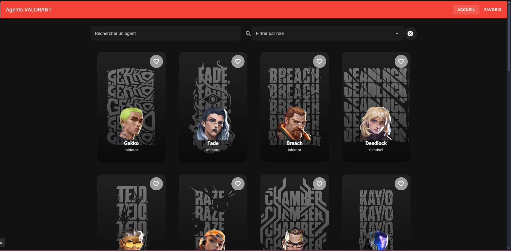

# 🌐 Mon Projet Vue.js & Vuetify

## 1. 🎨 Présentation du projet

### Concept
- J'ai chosi l'API de valorant parce que j'ai déjà joué au jeu et qu'elle est complète
- Afficher les agents du jeu avec quelques fonctionnalités

### Fonctionnalités principales
- Affichage des agents (via API)
- Recherche / Tri / Filtres
- Fonctionnalité interactive (favoris, watchlist, paramètres…)
- Persistance locale (favoris ou préférences)

### Aperçu visuel
_(Capture d’écran de l’application)_  

---

## 2. 📚 Parcours d'apprentissage

### Ressources utilisées
#### Documentation & tutos
- [Vue 3 Docs](https://vuejs.org/guide/introduction.html)
- [Vuetify Docs](https://vuetifyjs.com/en/components/all/)
- [Pinia Docs](https://pinia.vuejs.org/)
- [Public APIs List](https://github.com/public-apis/public-apis)
- Chat gpt

#### Progression
- Semaine 1 : ...
- Semaine 2 : ...
- Semaine 3 : ...
- Semaine 4 : ...
- ...

---

## 3. 🛠️ Outils et méthodologie

### Environnement de développement
- **IDE** : VS Code / WebStorm / Autre
- **Versioning** : Git + GitHub
- **Dépendances principales** : Vue 3, Vuetify 3, Pinia, Axios/Fetch
- **Gestion API Keys** : `.env` + `.env.example`

### Installation & Run
- Cloner le repo :...
- Installer :... 
- Lancer :...
- Variables d’environnement : copier `.env.example` → `.env` et compléter les clés nécessaires  

### Méthodologie
- Découpage en composants réutilisables
- Props & Emits clairs
- Store global avec Pinia
- Commits réguliers et explicites
- Tests manuels (UI, persistance, erreurs API)
- ...

### Choix techniques
- API sélectionnée :  
- Justification du choix : API complète 
- Endpoints utilisés :  
- Limites/quotas connus : 

### Architecture (Descriptif + schéma simple + data-flow)
- `App.vue` : layout principal 
- `views/` : pages (liste, détail, favoris)  
- ...

**Data-flow résumé :**  
- Vue déclenche un **event utilisateur** → composant appelle une fonction du **store** → ...

---

## 4. 🧪 Tests et validation

### Tests techniques
- ✅ Appels API fonctionnels  
- ✅ Persistance vérifiée après refresh (localStorage)  
- ✅ Navigation entre les vues OK  
- ...

### Tests d’UX
- Navigation intuitive  
- Recherche/filtre/tri faciles à comprendre  
- Feedback utilisateur (loading, erreurs, vide)  
- ...

### Tests d’accessibilité
- Contraste couleurs (Vuetify par défaut)  
- Labels et placeholders corrects  
- Navigation clavier possible  
- Focus visible  
- ...

### Tests d’erreurs & fallback
- API down → **mock fallback** affiché (fichier local ou données simulées)  
- Liste vide → message clair affiché  
- Recherche sans résultat → affichage “Aucun élément trouvé”  
- ...

---

## 5. 🤖 Usage d’intelligence artificielle

**⚠️ TRANSPARENCE OBLIGATOIRE** : Si vous utilisez une IA, vous DEVEZ :

### IA utilisée
- **Nom** : ChatGPT 
- **Version** : GPT-5 
- **Contexte** : Génération de code / Debugging / Explication de lignes de codes

### Utilisation détaillée
**Domaines d'aide :**
- Aide au code général : X%
- Génération de snippets Vue/Vuetify : X%  
- Aide à la structuration du projet : 75%
- Debugging : 50%  
- Recherche d’idées : 0%  

**Compréhension et adaptation**
- Expliquer ce que fait le code généré 
- Dire comment il a été adapté au projet  

### Parties codées manuellement
- Composants principaux : X% personnel  
- Store & persistance : X% personnel  
- Routing & navigation : X% personnel  
- Tests & validation : 100% personnel  

### Apprentissage personnel
- Ce que j’ai appris grâce à l’IA  
- Comment elle m’a aidé à progresser  

---

## 6. 🎯 Bilan personnel

### Ce que j’ai appris
- Compétences techniques acquises  
- Découvertes surprenantes  
- Concepts difficiles maîtrisés  

### Difficultés rencontrées
- Problèmes techniques et solutions trouvées  
- Moments de blocage et dépassement  
- Aide reçue et sources  

### Réussites et fiertés
- Aspects du projet dont je suis fier  
- Progrès constatés depuis le début  
- Envies de développement futur  

### Améliorations possibles
- Ce que j’ajouterais avec plus de temps  
- Fonctionnalités bonus envisagées  
- Compétences à approfondir  

---

## 7. 📚 Références & Sources
- Documentation de l’API : [Nom de l’API](https://...)  
- Tutos clés utilisés : ...  
- Usage de l’IA : voir section ci-dessus  
- Autres ressources utiles : ...
